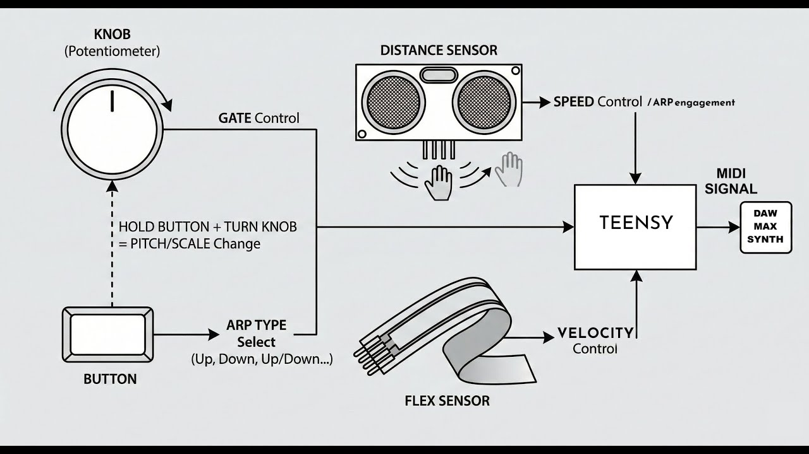

# Teensy Arpeggiator

This project contains the Arduino firmware (`arp_4_en.ino`) for a Teensy-based MIDI Arpeggiator. It allows the Teensy to receive MIDI notes (via USB or hardware MIDI) and process them into arpeggiated sequences.

## Technical schema

## Features
* **MIDI Arpeggiation:** Takes input chords and outputs sequential notes based on a set tempo and pattern.
* **Teensy Support:** Optimized for Teensy microcontrollers for low-latency MIDI processing.
* **English Comments:** The source code (`_en`) contains English comments for easier modification.

## Hardware Requirements
* **Microcontroller:** Teensy Board (e.g., Teensy 3.2, 4.0, LC, or 4.1).
* **USB Connection:** For power and MIDI over USB.
* **Controls:** Potentiometer, button and flexible controller connected to GPIO pins for changing tempo, latching, or arp modes (Up, Down, Random).

## Software Requirements
1.  **Arduino IDE:** [Download Here](https://www.arduino.cc/en/software)
2.  **Teensyduino Add-on:** [Download Here](https://www.pjrc.com/teensy/td_download.html)

## Installation & Upload
1.  Open the `arp_4_en.ino` file in the Arduino IDE.
2.  Go to **Tools > Board** and select your specific Teensy model.
3.  Go to **Tools > USB Type** and select **"MIDI"** (This is crucial for the device to be recognized as a MIDI device by your computer).
4.  Connect your Teensy via USB.
5.  Click the **Upload** button (arrow icon).
6.  If prompted, press the physical button on the Teensy board to enter programming mode.

## Usage
1.  Connect the Teensy to your computer.
2.  Open your DAW (Digital Audio Workstation) or the companion Max/MSP patch.
3.  Select "Teensy MIDI" as your MIDI input device.
4.  Play a chord; the Teensy should output arpeggiated notes.

## Pinout Configuration
* Check the variable definitions at the top of the `.ino` file for the exact pin assignments.*
* **Tempo Pot:** usually connected to an Analog Pin (e.g., A0).
* **Mode Button:** usually connected to a Digital Pin.

## Video presentation
- [YouTube](https://www.youtube.com/watch?v=6QNuypYggt0)
